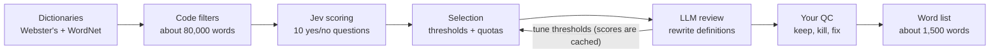

# Bluff Dictionary — Game Spec

Exported from the working doc on 2026-09-25. Part 1 is the game; part 2 is the word pipeline. The word list itself is in `data/starter-words.md` (readable) and `data/words.json` (for code).

---

# Part 1: The game

## The problem and the fix

Classic Balderdash punishes funny bluffs. Real definitions sound like a dictionary, so a joke definition is obviously fake, and the winning move is writing boring ones. The fix has two parts:

1. Pick words whose real definitions are already gross, cheeky, or absurd, so silly bluffs stay plausible. The 255-word starter list is in `data/starter-words.md`.
2. Remove style tells. Real definitions are written in the same casual voice players use, and the part of speech is announced up front so a noun bluff can't lose to a verb.

The test: the real definition should get picked at about chance, 1 in however many options there are. Below chance is fine; the truth is fooling people. Above chance means a tell is back.

Tone is PG-13, not Cards Against Humanity. The spicy words exist so raunchy bluffs aren't automatically ruled out, not as the main event.

You don't need thousands of words. A group playing 12 rounds a week uses about 600 a year, so 1,500 good words beats 10,000 mediocre ones; a bad word makes a dead round.

## What makes a good word

A good word has a real definition someone could plausibly have invented as a joke. Mix these four types, because the mix is what keeps players guessing:

| Type | What it is | Examples |
| --- | --- | --- |
| Sounds dirty, isn't | innocent meaning, rude-sounding word | titivate, cockchafer, fartlek, vomitorium |
| Exactly as gross as it sounds | real meaning is as crude as any bluff | gardyloo, borborygmus, merkin, spraint |
| Absurdly specific | a word for something nobody needs a word for | gongoozler, groak, spanghew, scurryfunge |
| Great insult | colorful old put-downs | slubberdegullion, snollygoster, fopdoodle |

Disqualifiers:

- Too well known (defenestrate, kerfuffle, lollygag). Most of your group shouldn't have heard it.
- Meaning guessable from its parts.
- Real definition over about 15 words, or one that needs a history lesson.
- Slurs and ethnic or gendered insults. Old slang dictionaries are full of them, so this filter does real work.
- Medical terms for things that are actually sad, like diseases and disorders.

Tag every word mild, cheeky, or spicy so a group can filter by audience. Spicy means sexual. Cheeky means crude, bodily, or rude-sounding, but not sexual.

## Growing the list

The full design is in Part 2. Random words come from standard dictionaries and pass an obscurity filter. Jev classifies each one with yes/no questions (oddly specific, gross, sounds funny, insult, boring). Code applies thresholds and quotas weighted toward oddly specific, and an LLM tunes the thresholds and rewrites definitions. A pilot that fills 10 words per bucket for QC is built and ready to run.

Word lists generally aren't copyrightable, but definitions are. Rewriting definitions in our own voice from public-domain or openly licensed sources keeps us clear: Webster's 1913, Open English WordNet (CC BY 4.0), and Wiktionary (CC BY-SA). Don't copy Merriam-Webster or OED text.

## Rules

Keep standard Balderdash scoring and add a point for being funny, so comedy is rewarded directly and not only when it fools someone.

| Event | Points |
| --- | --- |
| You pick the real definition | +2 to you |
| Someone votes for your fake | +1 per vote |
| Nobody picks the real definition | +3 to the dealer |
| Your fake is basically correct | +3, and it's pulled from the ballot (in person only; left out of the online MVP) |
| Funniest bluff of the round (quick separate vote, or dealer's call) | +1 |

Other rule changes:

- The dealer announces the part of speech before anyone writes.
- If anyone already knows the word, skip it.
- About 2 minutes to write; short keeps it punchy.
- With only 3 players, the dealer slips in one extra fake of their own so there are more options to vote on.

## Online version

Build it Jackbox-style: someone creates a room, everyone joins from their phone with a 4-letter code, and there are no accounts or app installs. It works in person (phones as controllers, optional TV) or remotely over a call.

Each round runs: lobby → word shown with part of speech (anyone can tap "I know it" to reroll) → writing, 90 seconds → voting on a shuffled list, can't vote for your own → reveal of each fake's author and voters, real one last, plus a fun fact → scores → next word.

Design choices:

- No dealer online. The app supplies the real definition, so everyone writes every round, which is better for small groups.
- Light formatting cleanup on every submission (capitalize, add a period, trim spaces, cap at 140 characters) so typing style doesn't give anyone away. Plain code, no AI needed.
- Laugh reactions on any definition feed the funniest-bluff point.
- Optional AI decoys for 3–4 player games, written in the pipeline's rewrite step so they get reviewed with the word.
- Room settings: spice level, categories, number of rounds, timer length.

Stack:

- Frontend: a mobile-first React app built with Vite, one codebase for the host screen and player phones.
- Realtime: a Cloudflare Worker with one Durable Object per room. The object holds the game state, runs the timers, and pushes updates over WebSockets.
- Words: the pipeline's words.json, bundled with the app. Per-word play stats can move to Cloudflare D1 later.
- Skip Kubernetes, Redis, and user accounts. Room-scoped party state doesn't need them, and hosting should cost a few dollars a month.

Each word record holds: word, part of speech, casual definition, dealer note, type, spice tier, category, source, and play stats (times played, real-pick rate, skip rate).

## Milestones and decisions

Play the starter list in person before building anything; it's the cheapest test of the whole idea.

| Step | What | Done when |
| --- | --- | --- |
| 1 | Play the starter list in person | 2–3 game nights, with notes on which words fell flat |
| 2 | Pipeline v0 | 1,000 curated words |
| 3 | Web MVP | lobby, writing, voting, reveal, and scoring work on phones |
| 4 | Polish | spice and category filters, funniest vote, AI decoys, reveal fun facts |

If funny bluffs still stick out with this list, the tell is in how definitions are read aloud, not in the words, and that's a rules fix.

Decided for the MVP:

- In person first: phones as controllers, with an optional TV screen. Remote play comes free later, since it's the same app over a call.
- Private rooms only. No public games, so no moderating strangers.
- No dealer online. Everyone writes every round.

---

# Part 2: Dictionary pipeline

## Overview

The dictionary is built in two passes. A pilot scores random words until each of 5 buckets has 10, for a first QC check. It's built and ready to run. A full run then scores about 80,000 candidates once and cuts about 1,500 keepers from the cached scores.

Jev only classifies. Code handles obscurity, filtering, and quotas. An LLM reviews samples to set thresholds and rewrites the keepers' definitions in a casual voice.

The final mix leans toward oddly specific words, because they're the most varied and hardest to fake. At about 1,000 input tokens per word, scoring the full pool costs about $3.50.

Jev runs once per word. Changing a threshold or quota only re-sorts the cached scores, so tuning costs nothing.

## Sources and filters

The pilot draws from two standard dictionaries, not slang lists: Webster's Unabridged (the 1913 text, public domain) and Open English WordNet 2022 (CC BY 4.0). Merged, they hold about 166,000 distinct words.

| Source | Starter words it has (of 255) |
| --- | --- |
| Webster's 1913 | 133 |
| Open English WordNet 2022 | 111 |
| Both combined | 165 (65%) |

The 90 misses are mostly dialect and modern coinages (gongoozler, scurryfunge, widdershins, octothorpe). For the full run, add Wiktionary via kaikki.org, which should cover nearly all of them. The workspace that built the pilot couldn't reach kaikki, so that loader is still to be written.

Filters, all in code:

- Single words of 4–20 letters, hyphens allowed. Phrases are out for now because word frequency scores a phrase by its common parts ("link boy" looks common).
- Zipf frequency ≤ 2.5 (wordfreq). Most starter words (57%) have Zipf 0, and 90% are at 2.04 or below.
- Drop cross-references ("See X"), inflections, words ending in -ness, "in a ___ manner" adverbs, and taxonomy entries ("A genus of…").
- Drop definitions that just spell out the word ("contradicter: one who contradicts").

About 80,000 words survive. So do 153 of the 163 single-word starter words found in the dictionaries. Most of the lost ones are common words used in an obscure sense (prat, brawn, lights, fuller). The rest are 3-letter words (yex, olm), a hyphenated word with common parts (smell-feast), and a bare cross-reference (crwth).

Frequency alone can't catch familiar words. Kerfuffle (2.3), lollygag (1.2), and defenestrate (1.0) sit in the same range as the starter words, so Jev also asks whether most adults would know the word.

## Jev scoring

Each word gets one Jev request with its word, part of speech, and up to 3 definitions. The request carries 10 yes/no questions plus one Choice, all answered in parallel. The model is pinned to jev-1.13.0 so thresholds stay comparable when the alias moves.

| Question | Asks | Used as |
| --- | --- | --- |
| oddly_specific | Is a definition so particular it sounds like a made-up joke? | bucket (favored in ties) |
| gross | Is a definition about bodily functions, fluids, dung, smells? | bucket |
| sounds_funny | Ignoring meaning, does the word sound silly or rude aloud? | bucket |
| insult | Is a definition a colorful name for a kind of person? | bucket |
| boring | Are all definitions dry, technical, or ordinary? | bucket (the reject pile) |
| familiar | Would most adults know the word? | reject if ≥ 0.5 |
| offensive | Is it a slur, or an insult aimed at a group? | reject if ≥ 0.5 |
| sad | Is it a serious disease or disability? | reject if ≥ 0.5 |
| spicy | Is a definition about sex, lust, kissing, genitals, or cheating? | spice tier |
| cheeky | Is the word or a definition crude, bodily, rude-sounding, or mildly naughty, without being sexual? | spice tier |
| best_definition (Choice) | Which definition would be the funniest real answer? | picks the sense to use |

Each question follows TypeSafe's guidance for jev-1.13: one judgment per question, written literally, with boundary cases in the yes/no criteria. For example, the sad question says hiccups and earwax don't count. The exact wording is in `pipeline/questions.py`.

Two things to watch in QC:

- sounds_funny is the least natural question for Jev, which reads text rather than hearing it.
- The Choice may pick an obsolete sense. That's fine for play, since the definition is still real, but it should carry an "archaic" note.

## Selection

Selection is plain code over the cached scores. First, any word Jev puts at 0.5 or higher for familiar, offensive, or sad is out. Each remaining word goes to its highest-scoring bucket at or above the bucket threshold. The pilot starts that threshold at 0.6; review sets the final values.

Within a bucket, rank by bucket score minus the familiar score, then fill the quotas. Oddly specific gets the largest share:

| Bucket | Share | Words (of 1,500) |
| --- | --- | --- |
| Oddly specific | 40% | 600 |
| Gross | 20% | 300 |
| Insult | 15% | 225 |
| Sounds funny | 15% | 225 |
| Wildcard: LLM or QC favorites that fit no bucket | 10% | 150 |

Diversity caps, applied while filling:

- One word per family. Collapse words that share a 5-letter stem and a meaning, keeping the higher scorer.
- At most 3 words per learned root (copro-, pyg-, -phagia).
- Spicy-tagged words are capped at 10% of the list, and dialect-tagged words (Scots, provincial) at 15%.
- Nouns are 59% of the pool and verbs only 10%. Hold verbs to at least 15% of the list, since verbs make some of the funniest bluffs.

If a bucket's pool runs short of its quota, the leftover slots go to oddly specific first.

Spice tier comes from the scores: spicy if spicy ≥ 0.5, otherwise cheeky if cheeky or gross ≥ 0.5, otherwise mild. The cheeky question covers rude-sounding names like cockchafer as well as meanings.

## Review, tuning, and rewrites

Thresholds are set from evidence, in this order:

1. **Pilot QC (hand review).** Read the 50 words in qc.md. If a bucket is full of misfits, fix that question's wording before tuning anything. A threshold can't rescue a question Jev reads differently than intended.
2. **Recall on the starter list.** Score the 153 starter words in the pool; this costs pennies. Each is known to be good, so a word that clears no bucket is a miss. Aim for at least 80% of them clearing some bucket.
3. **Score bands (LLM).** From the full run, an LLM reads about 50 words from each band of every bucket score (0.5–0.6, 0.6–0.7, and so on) and marks each keep or kill. Each bucket's threshold goes where keep rates fall below about 50%.
4. **Rewrites (LLM).** Each keeper's chosen definition is rewritten in a casual voice of 15 words or fewer, using only the source text. A second pass checks each rewrite against its source, because models confidently invent meanings for rare words. It also writes a dealer note using only facts in the source, such as the word's origin. It also writes two decoy fake definitions in the same voice, for 3–4 player games.
5. **Final QC (hand pass).** Swipe keep, kill, or fix on about 2,500 candidates to land about 1,500.

After launch, play stats feed back in. Words skipped as "I know it" or picked well above chance lose rank, and the list re-cuts from cached scores.

## Implementation

It's a small Python project: typesafe-sdk (async client), wordfreq, and the standard library. The pilot already includes the dictionary loaders, filters, question set, rate limiter, and a mock Jev for dry runs. The full run adds three pieces:

- **Score cache.** A SQLite table keyed by word, part of speech, model version, and a hash of the question set. Re-cuts read from it. A reworded question invalidates only its own column.
- **Wiktionary loader.** Stream kaikki.org's English JSONL, keeping each word's senses, part of speech, and usage tags (archaic, dialectal, obsolete).
- **Exporter.** Writes words.json for the game: word, part of speech, definition, dealer note, bucket, spice tier, usage tags, source, and two decoys.

Cost and runtime at about 1,000 input tokens per word (estimated; the pilot will show real counts), $0.042 per million tokens, and 15 requests per second:

| Run | Words scored | Cost | Time |
| --- | --- | --- | --- |
| Pilot | until full, capped at 6,000 | $0.25 at most | under 7 min |
| Starter-list recall | 153 | under $0.01 | under 1 min |
| Full run | about 80,000 | about $3.50 | about 90 min |

The account limit is 1,200 requests a minute, and TypeSafe says it's changing without notice. The script stays at 15 per second and relies on the SDK's retry with backoff.

## Risks and open questions

- **Jev is new.** Jev 1.13 shipped on September 15 and gives no reasons for its scores. The pilot QC and the starter-list recall are the only evidence it gets this task.
- **Sparse buckets.** Gross words and insults may be rare in a random dictionary sample. If the pilot hits its 6,000-word cap before those buckets fill, the full run's yield for them will be thin. The pilot's per-question rates project it.
- **Archaic voice.** Webster's definitions read like 1913, which is the tell the game is trying to avoid. The LLM rewrite handles it, but only if it stays grounded in the source.
- **Coverage.** Without Wiktionary, about a third of the kind of words we want are missing.

Decided: the final list is 1,500 words, and phrases (night soil, link boy, gong farmer) wait for v2. They're some of the best entries, but they need their own path around the frequency filter.

Still open:

- [ ] Should a common word with an obscure sense (lights, fuller, prat) be allowed, flagged so the dealer warns players?
